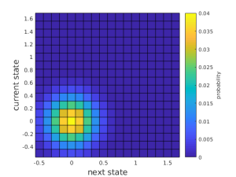

# markov_delta

## What is the program?
The outcome of a simple project during the SIESD 2018, where we looked at the randomness of elevation change (dz/dt) in deltas.
We used Markov Chains to model sequences of elevation changes in a stratigraphic column and converted these sequences to stratigraphy based on the concept of a "stratigraphic filter".

## Summary of the modeling and results
We used the [Tulane Delta Basin experiment 12-1](http://sedexp.net/catalog/tdb121-tulane-delta-basin) which has a constant Qw/Qs ratio and RSLR rate to inform our model.

Three models were produced: a purely random walk model, a Gaussian distributed Markov transition matrix, and a Markov transition matrix that was based on the observed elevation changes in the TDB-12-1 experiment.

 <!-- .element height="25%" width="25%" -->  <!-- .element height="25%" width="25%" -->

The result from _a single realization of each model_ is below. 
The stratigraphic sequences are compared to random columns of stratigraphy pulled from the TDB-12-1 experiment (gray).

### Downloading and running the program
The main source code all lives in `src` folder. 
You will need to obtain the data from the SEN website listed above, or ask the authors for a copy of the data formatted into a `.mat` file (it's too big to put on here...).
If you format the data yourself, produce a 3D matrix with each cell where the x-y-z coordinates are time-across-along.

The files in `src` can then be run in sequence of:

* `preprocess.m`
* `markov_matrix.m`
* `markov_model.m`

## Authors

* Kelly Sanks ([@kmsanks](https://github.com/kmsanks))
* Andrew J. Moodie ([@amoodie](https://github.com/amoodie))
